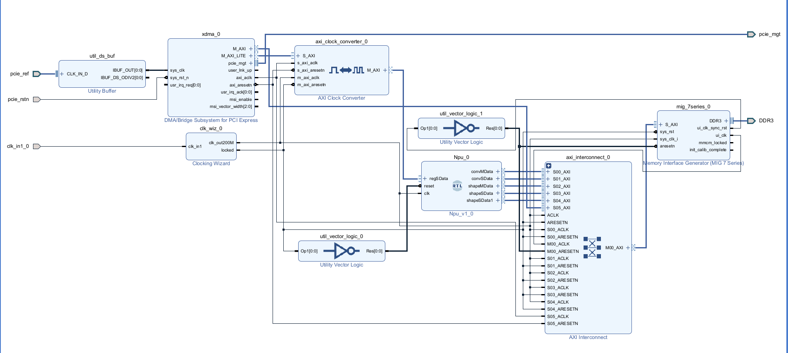

# About SpinalHDL_CNN_Accelerator

[中文说明](./README_CN.md)

## Implementing accelerator supporting various neural networks in SpinalHDL

- This repository is implementing common operators in CNN in SpinalHDL 1.7.3.It can be guided by compiler to generate accelerators for various neural networks.
- This repository aims to implement a general accelerator at the SpinalHDL level and a special accelerator at the Verilog level.
- This repository implements an Npu module, which can be put into the project,as shown in the figure.

- The resource occupation in FPGA is shown in the figure below:

## Description

This repository hosts a CNN Accelerator implementation written in SpinalHDL. Here are some specs :

- Easy to use
- Complete implementation of convolution, quantization and shape 
- Configurable parametric interface
- Optional convolution kernel type
- The FPGA resource occupation is optimized at the code level
- Implementation of rich tool class code
- Access control of DMA and AXI
- Automatically generate TCL files for instantiating Xilinx IP
- Top-level files are easy to run
- Implementation of the simulation of convolution

## RTL code generation
You can find three runnable top modules in:
- `src/main/scala/top.scala`
- `src/main/scala/Npu.scala`
- `src/test/scala/TbConv.scala`

NOTES:
- It could take time when you run it.
- `top.scala` is used to implement convolution.
- `Npu.scala` is used to implement complete project process.
- `TbConv.scala` is used to implement the simulation of convolution.
- Before you run the `TbConv.scala`,you should prepare files with feature and weight in advance.

